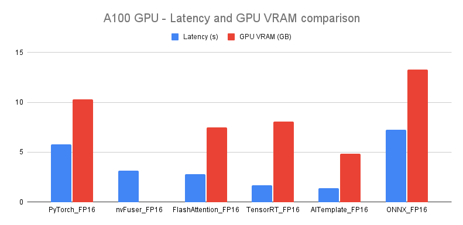
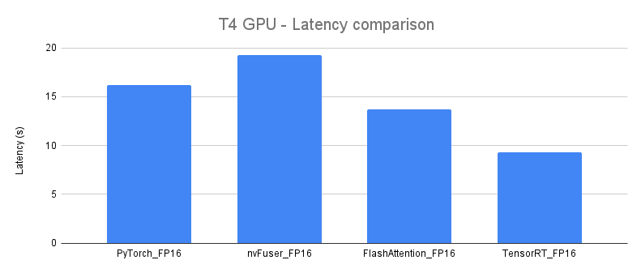
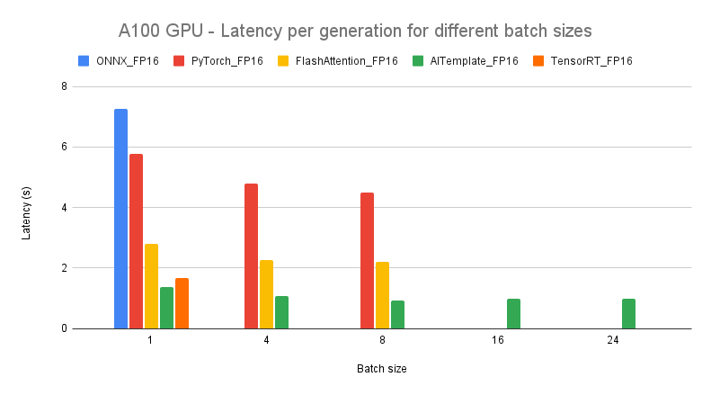

<p align="center">
  
  
</p>

<br>

<!-- # ⚡️ Real-time inference for Stable Diffusion -->
<!--  -->

<!-- <p align="center">
 
</p> -->

Welcome to `x-stable-diffusion` by Stochastic!

This project is a compilation of acceleration techniques for the Stable Diffusion model to help you generate images faster and more efficiently, saving you both time and money.

With example images and a comprehensive benchmark, you can easily choose the best technique for your needs. When you're ready to deploy, our CLI called `stochasticx` makes it easy to get started on your local machine. Try `x-stable-diffusion` and see the difference it can make for your image generation performance and cost savings.

## ✅ Stochastic

Stochastic was founded with a vision to make deep learning optimization and deployment effortless. With our cloud platform, you can easily optimize and deploy your deep learning models with confidence, knowing that you are getting the best performance possible. Our platform automatically optimizes your models, benchmarking them on various evaluation metrics to ensure they are running at their peak.

And when it comes time to deploy, Stochastic has you covered with auto-scaling accelerated inference for models like BLOOM 176B, Stable Diffusion, and GPT-J. Plus, our platform is cloud agnostic, supporting AWS, GCP, Azure, and Kubernetes clusters

<p align="center">
 
</p>

For fully-managed solution hosted on Stochastic [Sign up →](https://app.stochastic.ai/signup)
</br >
For private hosting on your cloud or on-prem [Contact us →](https://stochastic.ai/contact)

<!-- TOC -->
<!-- Table of contents:
- [Installation](#-installation)
    - [Quickstart](#quickstart)
    - [How to get less than 1s latency?](#how-to-get-less-than-1s-latency)
    - [Manual](#manual-deployment)
- [Optimizations](#-optimizations)
- [Benchmarks](#benchmarks)
  - [Setup](#setup)
  - [Online results](#online-results)
      - [A100 GPU](#a100-gpu)
      - [T4 GPU](#t4-gpu)
  - [Batched results](#batched-results)
  - [Sample images generated](#sample-images-generated)
- [Colab Notebooks](#how-to-run-with-google-colab)
- [References](#references) -->
<!-- /TOC -->

## 🚀 Installation

### Quickstart

Make sure you have [Python](https://www.python.org/downloads/) and [Docker](https://docs.docker.com/engine/install/) installed on your system

1. Install the latest version of `stochasticx` library.
```
pip install stochasticx
```

2. Deploy the Stable Diffusion model
```
stochasticx stable-diffusion deploy --type aitemplate
```

If you don't have a Stochastic account, then the CLI will prompt you to quickly create one. It is free and just takes 1 minute [Sign up →](https://app.stochastic.ai/signup)

> Alternatively, you can deploy stable diffusion without our CLI by checking the steps [here](#manual-deployment).


3. To perform inference with this deployed model:
```
stochasticx stable-diffusion inference --prompt "Riding a horse"
```
 Check all the options of the `inference` command:
```
stochasticx stable-diffusion inference --help
```


4. You can get the logs of the deployment executing the following command:
```
stochasticx stable-diffusion logs
```

5. Stop and remove the deployment with this command:
```
stochasticx stable-diffusion stop
```

### How to get less than 1s latency?

Change the `num_inference_steps` to `30`. With this, you can get an image generated in 0.88 seconds. 

```javascript
{
  'max_seq_length': 64,
  'num_inference_steps': 30, 
  'image_size': (512, 512) 
}
```

You can also experiment with reducing the `image_size`.

## How to run on Google Colab?

- [Try PyTorch - FP16 in Colab ->](https://colab.research.google.com/drive/1m3n2n5bfNpRgWJ8K-xwTvhzrTQETWduq?usp=sharing)
- [Try TensorRT in Colab ->](https://colab.research.google.com/drive/1WQ98YBHTG355vL5wKbmNj9xeBmHRZGJb?usp=sharing)

In each folder, we will provide a Google Colab notebook with which you can test the full flow and inference on a T4 GPU

### Manual deployment

Check the `README.md` of the following directories:
- [AITemplate](./AITemplate/README.md)
- [FlashAttention](./FlashAttention/README.md)
- [nvFuser](./nvFuser/README.md)
- [PyTorch](./PyTorch/README.md)
- [TensorRT](./TensorRT/README.md) 

## 🔥 Optimizations

- AITemplate: [Latest optimization framework of Meta](https://github.com/facebookincubator/AITemplate)
- TensorRT: [NVIDIA TensorRT framework](https://github.com/NVIDIA/TensorRT)
- nvFuser: [nvFuser with Pytorch](https://pytorch.org/blog/introducing-nvfuser-a-deep-learning-compiler-for-pytorch/)
- FlashAttention: [FlashAttention intergration in Xformers](https://github.com/facebookresearch/xformers)


## Benchmarks

### Setup

For hardware, we used 1x40GB A100 GPU with CUDA 11.6 and the results are reported by averaging 50 runs.

The following arguments were used for image generation for all the benchmarks:

```javascript
{
  'max_seq_length': 64,
  'num_inference_steps': 50, 
  'image_size': (512, 512) 
}
```

### Online results
For `batch_size` 1, these are the latency results:

#### A100 GPU



| project                | Latency (s) | GPU VRAM (GB) |
| :--------------------- | :---------- | :------------ |
| PyTorch           fp16 |  5.77       |  10.3         |
| nvFuser           fp16 |  3.15       |  ---          |
| FlashAttention    fp16 |  2.80       |  7.5          |
| TensorRT          fp16 |  1.68       |  8.1          |
| AITemplate        fp16 |  1.38       |  4.83         |
| ONNX (CUDA)            |  7.26       |  13.3         |


#### T4 GPU
> Note: AITemplate might not support T4 GPU yet. [Check support here](https://github.com/facebookincubator/AITemplate#installation)



| project                | Latency (s) |
| :--------------------- | :---------- |
| PyTorch           fp16 |  16.2       |
| nvFuser           fp16 |  19.3       |
| FlashAttention    fp16 |  13.7       |
| TensorRT          fp16 |  9.3        |

### Batched results - A100 GPU

The following results were obtained by varying `batch_size` from 1 to 24.



| project           \ bs |      1        |     4         |    8          |    16             |   24              | 
| :--------------------- | :------------ | :------------ | :------------ | :---------------- | :---------------- |
| Pytorch           fp16 | 5.77s/10.3GB  | 19.2s/18.5GB  | 36s/26.7GB    |  OOM              |                   |
| FlashAttention    fp16 | 2.80s/7.5GB   |  9.1s/17GB    | 17.7s/29.5GB  |  OOM              |                   |
| TensorRT          fp16 | 1.68s/8.1GB   |  OOM          |               |                   |                   |
| AITemplate        fp16 | 1.38s/4.83GB  | 4.25s/8.5GB   | 7.4s/14.5GB   |  15.7s/25GB       |  23.4s/36GB       |
| ONNX (CUDA)            | 7.26s/13.3GB  | OOM           | OOM           |  OOM              |  OOM              |

> Note: TensorRT fails to convert UNet model from ONNX to TensorRT due to memory issues.

### Sample images generated

[Click here to view the complete list of generated images](./generated_images/README.md)

| Optimization \ Prompt | Super Mario learning to fly in an airport, Painting by Leonardo Da Vinci | The Easter bunny riding a motorcycle in New York City | Drone flythrough of a tropical jungle convered in snow
| --- | --- | --- | ---
| PyTorch           fp16 |        |           |  |
| nvFuser           fp16 |       |           |  |
| FlashAttention    fp16 |        |           |  |
| TensorRT          fp16 |        |           |  |
| AITemplate        fp16 |        |           |  |

## References

- [HuggingFace Diffusers](https://github.com/huggingface/diffusers)
- [AITemplate](https://github.com/facebookincubator/AITemplate)


## Team and contributors

x-stable-diffusion is a community-driven project with several AI systems engineers and researchers contributing to it. 

It is currently maintained by: [Toan Do](https://github.com/Toan-Do), [Marcos Rivera](https://github.com/MarcosRiveraMartinez), [Sarthak Langde](https://github.com/sarthaklangde), [Subhash GN](https://github.com/subhash-stc), [Riccardo Romagnoli](https://github.com/RiccardoRomagnoli), [Roman Ageev](https://github.com/StochasticRomanAgeev) and [Glenn Ko](https://github.com/glennko)

## 🌎 Join our community

- Discord - https://discord.gg/TgHXuSJEk6
